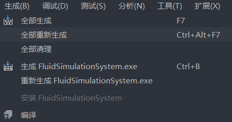

# Fluid Simulation System

# 环境配置

- 操作系统: `Windows 10`
- 编译器：`MSVC(Visual Studio 2022)`
- `Opengl 3.3` 以上
- `CMake 3.8` 以上

# 编译说明

1.  右键`./code`文件夹->使用`Visual Studio`打开

2.  项目->配置缓存

3.  生成->全部重新生成

4.  选择启动项

# UI 说明

- 系统初次运行后，请先拖动窗口，设置窗口位置。
  

- 我们可以选择各种模拟方法。系统中共有二维和三维场景下、拉格朗日描述与欧拉描述的共四种模拟方法。（当你刚运行代码，点击 Continue 后粒子块/网格也并不会变化，如何让它像流体一样动起来，这就是你要完成的求解工作）
  

- 选择三维场景的模拟方法后，通过鼠标的缩放、左键拖动、右键拖动等动作，可以控制摄像机(Camera)。

- 当停止（Stop）模拟后，渲染并不会停止。如果你的三维场景下的求解算法不能做到实时运行，可以暂停后再控制摄像机观察细节。

- 系统输出了日志、FPS、以及用时等基本信息。

# 如何编写流体求解器

与渲染系统不同，本系统的渲染代码（Renderer）、粒子系统（Particle System）与网格系统（MAC grid）均已实现。同学们需要做的是如何在已有粒子系统或网格系统的基础上，实现相应的求解器（Solver），具体说明可见[代码说明](./doc/intro.md)。

# 模拟结果示例

见`./result`

# 其他

1. [代码说明(intro.md)](./doc/intro.md)

2. 系统于 2024 年 3 月完成，还有很多不足之处，望同学们批评指正。

3. 该系统旨在为缺乏 OpenGL 编程经验或图形学基础的同学提供帮助，使他们无需花费时间在搭建 UI、学习 OpenGL 等任务，可以将注意力集中在流体求解代码的编写上。如果同学已经具备相关的基础知识，亦可独立完成作业。
