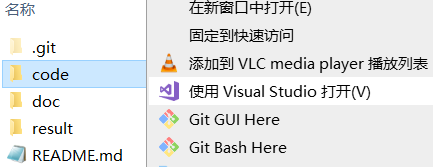
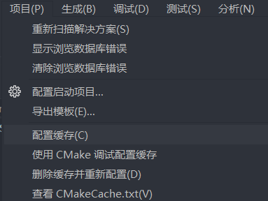
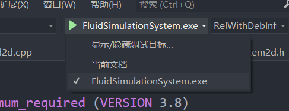
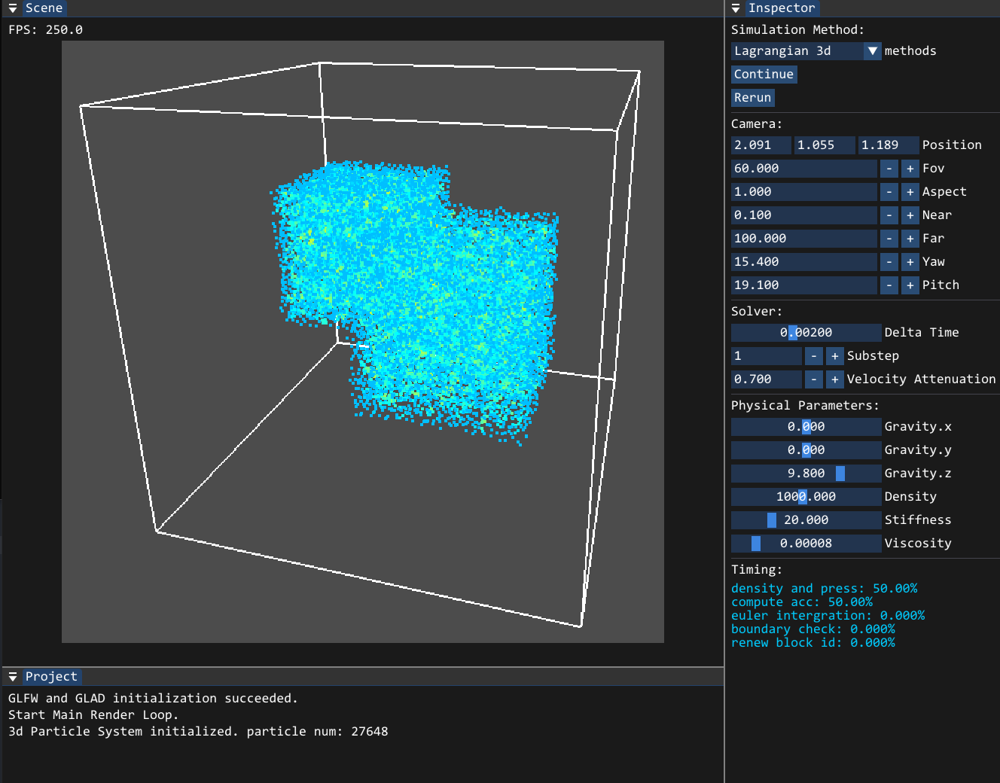
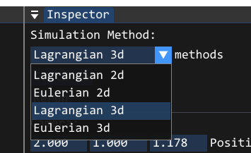
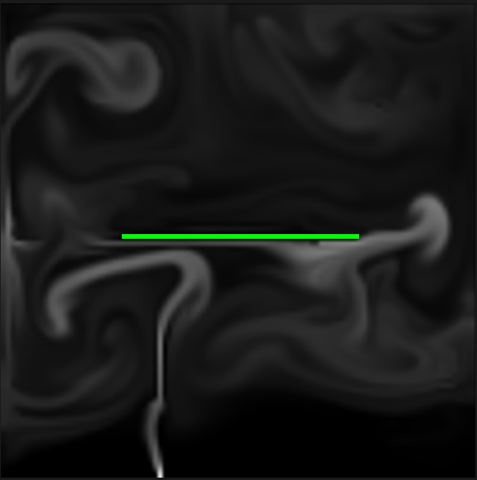

# Fluid Simulation System

# 环境配置

- 操作系统: `Windows 10`
- 编译器：`MSVC(Visual Studio 2022)`
- `Opengl 3.3` 以上
- `CMake 3.8` 以上

# 编译说明

1.  右键`./code`文件夹->使用`Visual Studio`打开

2.  项目->配置缓存

3.  生成->全部重新生成

4.  选择启动项

# UI 说明

- 系统初次运行后，拖动窗口，设置窗口位置。
  

- 可以选择各种模拟方法。系统中共有二维和三维场景下、拉格朗日描述与欧拉描述的共四种模拟方法。
  

- 选择三维场景的模拟方法后，通过鼠标的缩放、左键拖动、右键拖动等动作，可以控制摄像机(Camera)。

- 系统输出了日志、FPS、以及用时等基本信息。

# 模拟结果示例

视频可见`./result`

# 其他

[代码说明(intro.md)](./doc/intro.md)
